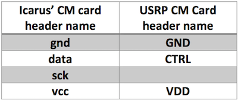
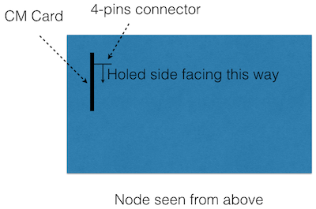
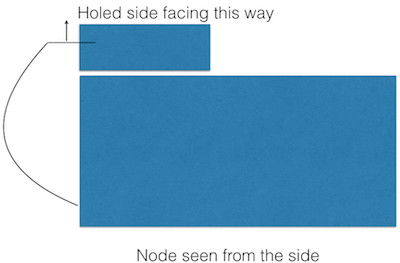

# Installation of the USRP extension of the CM card

## General Information

See [the NITOS doc for general information](Installation of NITOS USRP CM.pdf)

## Orientation of the Dupont connector

As explained in the NITOS guide, the 4-wire Dupont cable connects the 2 CM cards :

 * main CM card is the one inside the node metal box
 * extension card is the one inside the little plastic box
 
In addition the 2 Ground pins  - labelled `GND` - must be connected together, as follows :



However the dupont cables can be used in both directions on any of their ends, so here is our convention to avoid mis-connections :

 * on each end there is a black plastic block connector
 * one side of the connector is plain, the other one has 4 holes (see figures)
 * inside the box, the **holed side** of the connector is oriented **towards the inside of the box**
 * on the USRP CMC, the **holed side** of the connector is **upwards**






## USB cables

Is is important to use a **small cable between the CM extension card and the USRP device**.


We have figured that the length of the USB cables could hinder the overall connection speed between CPU and URSP.

Here's a summary of the observations made at the time; blue means a small 30cm-ish USB3 cable, black means a more regular lengh cable

```
Node -> blue  -> CMC -> blue  -> USRP (total : 60cm)  : OK (16s)
Node -> black -> CMC -> blue  -> USRP (total : 1.30m) : OK (16s)
Node -> blue  -> CMC -> black -> USRP (total : 1.30m) : KO (64s)
Node -> black -> CMC -> black -> USRP (total : 2m)    : KO (64s)
```

