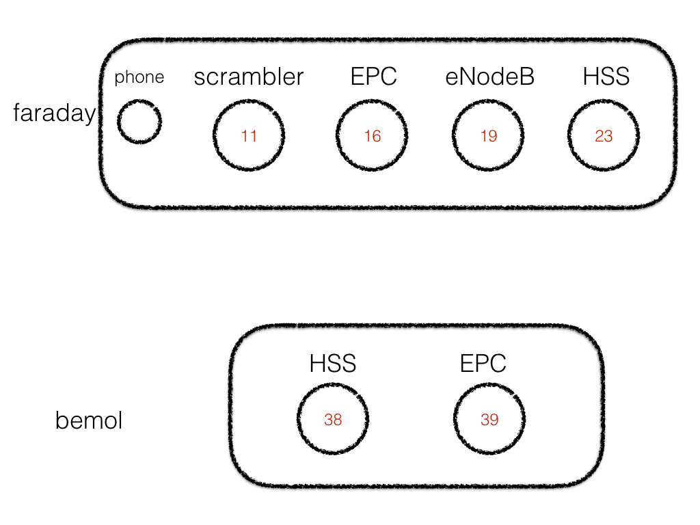

# prep infra

**WARNING** 

**USE node 19 for enb for now**

```
### the HSS box
n 23
rload -i oai-gw-builds5 23 16
```
```
### the EPC box
n 16
```
```
### the ENB box
n 19
#rload -i oai-enb-builds-uhd394-oscillo 19
rload -i oai-enb-builds2 19
```

```
### the scambler box
n 11
rload -i oai-scrambler 11
```

# prep demo

```
### the scrambler box
n 11
rload -i oai-scrambler
rwait
ss
demo
refresh
```
```
### the mac box to turn phone on or off
macusb
phone status
```

# common scenario

for the 3 boxes

```
rwait; ss
---
refresh
demo
o prepare
o start
o logs
```

# the scrambler

```
```

# Details

*****
*****
*****

# ONGOING

* have rebuilt image `oai-enb-builds`

# DB report

```
select imsi, imei, access_restriction,  mmeidentity_idmmeidentity from users where imsi = 208950000000002;

select * from mmeidentity where mmerealm='r2lab.fr' ;
```

# `build_hss` 

 * patched version in my own repo, which is what the master branch on the images point at

# NOTES on generic kernel

* tried to rebuild from scratch (14.04)
* created `oai-epc-kgen-builds` (skipped the base step)
* that turned out to have 4.2, so
* created `oai-epc-k319-builds` 
* however this turned out to have a broken build for freediameter (no network or something - see build_epc-i.log)
* so now that I know how to switch kernels:
  * restarted from `oai-gw-builds3`
  * reinstalled `3.19.0-58-generic`
  * set `DEFAULT="1>2"` in `/etc/default/grub`
  * applied `grub-update`
  * and produced `oai-gw-kgen-builds3`