# OneLab Report
This document tries to summarize the features and improvements that we (Inria - Sophia) believe are now strong requirements to bring the Onelab portal to a production-ready tool.

It is based primarily on a few attempts made on guinea pig users, who had no prior knowledge of the tools, and who accepted to try the portal from a R2lab user's perspective.

Please bare in mind that R2lab has no local website for account creation, slice deployment and lease reservation, and so the workflow for our users requires the use of the myslice-based OneLab portal - unlike more mature testbeds like e.g. IotLab, NITOS and PLE. 

## Generic issues

### 1. Displaying resources is too slow - caching

Every single time someone tries out the portal, what we get withing the first 3 minutes is: 

> **Why is everything so slow ?**

I guess people could live with having to wait when the testbeds get probed the first time. 

But after having browsed around the UI to get a sense of what is offered, people come back to the dashboard 30s later and bang, the damn wheel starts spinning again, and then comes the loud **F...**

So: there definitely is a need to cache stuff somehow. Ideally the complete set of resources would be maintained locally by some dedicated process, like e.g. every 10 minutes or so.

### 2. Error reporting 

The most severe criticism that we received from users has to do with error reporting. Whenever something goes wrong, and an API call return a failure, there is no way to assess more accurately in what state things have been left off. From the very beginning, there had been in myslice the objective of exposing the entire content of the error material as reported by the underlying testbeds - possibly with assistance from the portal for making as much sense as possible from that data. Unfortunately this has been left aside for some reason, and now we're leaving our users with this feeling:

> **What just happened ?**

Even more confusing, in some cases it has been reported that a call was reporting an error but somehow the tool seemed to keep on going with further work. I don't have the exact context, but I do know that the general context was to deal with R2lab, so I would think this was not related to a setup involving several separate testbeds at the same time, but more likely to an attempt to attach a node and creating a reservation all at once; I might be wrong here. 

**These 2 first points (caching, error reporting) IMHO are crucial, and it is time to address them.**

### 3. Iron out the workflow

Last in the general comments, people are confused by the 2 required steps, which are to add a node to their slice, and then to add a reservation. The feeling here is 

> **What do I need to do now ?**

It would help a lot, for example, if 
* when a user that already has slices, the dashboard could directly open the last visited slice - instead of going to the complete list all the time
* when that slice already has resources, that are all or mostly reservable, then the slice dashboard could go directly to the 'Scheduler' tab.

This way, an unexperienced user would be directly directed to the scheduler view, in 'Reserved' mode. These of course are just general, and admittedly very rough suggestions, to give an idea of why people are easily confused. 

### 4. Make it clear when a logout is required

Sometimes in the process of slice creation, user **needs to log out** because otherwise the UI has outdated information; IIRC this is when requests like slice creation of project creation get approved by the local PI. 

> **Users should not need to logout; whenever this is required, at the very least, a message should be issued so that people are aware of that fact**

This can lead to useless frustration and waste of time. We recommend that these situations be made as few as possible, and in the cases where nothing seems doable, that some kind of warning be displayed that would make explicit the need for a new session.

## timeouts ?

A little less critical: we have also definitely seen cases where the UI does not return at all after 3 solid minutes. Probably due to some bug inside the portal itself, although a mishap on the testbed side can of course also cause this. Whatever the reasons, it seems that we need to avoid the UI from hanging for too long, by implementing some kind of a timeout, so that the UI comes back to life within a reasonable amount of time whatever happens behind the scene.

## Specific issues

### 1. problems when reserving resources
1. After select the "37nodes.r2lab" resources and click apply button the status was failure. This was in the first day tests.
It was fixed, but come back again today. Seems a little not unstable.
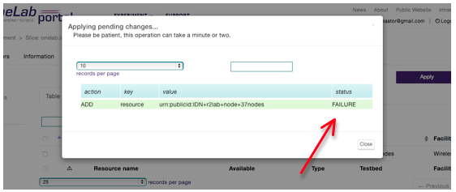
2. After unselect some resource in the first list the website still presents the unselected resource in the list. Could be confused for the user.
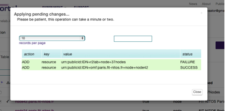
3. Fail in reserve the resources for days after the current.
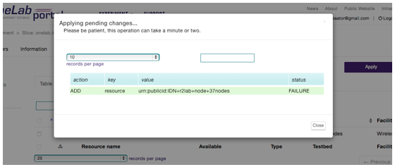
4. After change to Paris resources, the screen never ends to load. Must reload the page and wait again for the left panel load. All the time it takes almost 2 minutes.
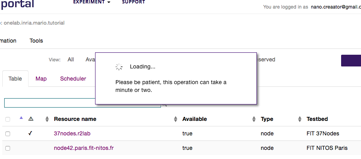

### 2. problems when creating projects
1. After login no information about the projects. They disappeared. I did logout/login again to fix it. 
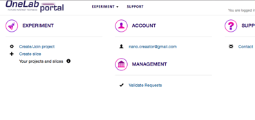

### 3. problems in creating a slice
1. When I try to select two resources and apply for the reservation a mysterious message appears. To fix it you must logout and login again or reload the page.
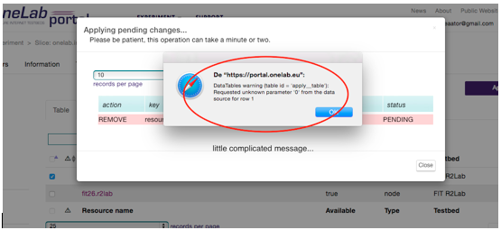
2. After had selected the slice correctly with the resource scheduled I had problems with public key.
nano$ ssh onelab.inria.mario.tutorial@faraday.inria.fr
Permission denied (public-key)
3. Once the slice is reserved successfully, the color blue is not in the list (should be green?)
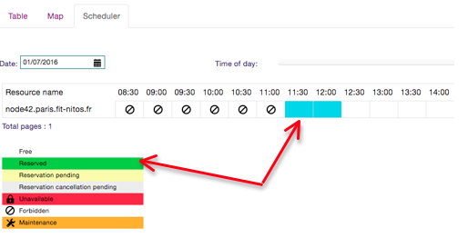
4. Unaccountable message. The user have no idea what means.
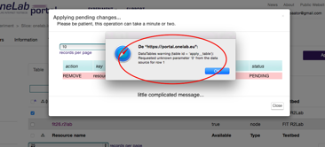

### 4. problems with access rules
5. I can login to faraday even my slice time ended. I can load images even my slice time ended. My slice was until 15:30.
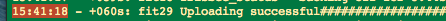

### 5. problems with layout
1. Position of the text.
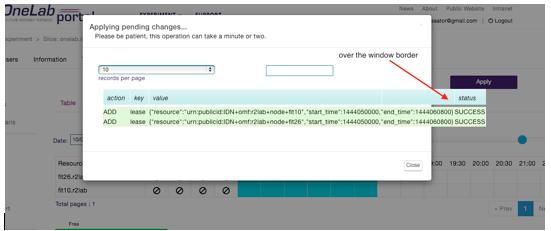
2. Comfused messages.
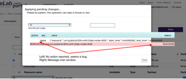
3. When clicked in the list of resources, to see where is located the resource, for some reason the map and the logo did not appeared.
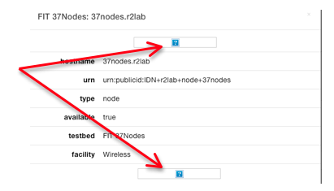
4. In the case below, for the user does not matter to much this kind of lease message. Maybe for the tech people. The time is also incomprehensible. All the user wants here is know if the reservation is ok.
If by a mistake or not, you click in close, the window will disappear and the loading screen in background never ends to load something. To come back to the window you must apply again the reservation.
I have no idea if the close only close the window or if cancel all.
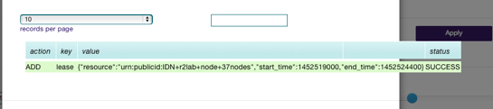
5. The negative message when reserve a slice just told me: FAILURE. In fact it was because someone else already took the slice. Failure is a little generalist. If the site could say that the time is already taken I would know that is not a problem but a concurrent time.

### 6. problems with layout and UI
1. There's no information about the address to SSH access or clear message how to access the resource. Must rolled the portal in all directions to find only the Paris platform address.
2. The panel of schedule is complex, The number of options for the user is huge. In resource/slice reservation's screen the user has ~25 links to click... only in the main screen. In all this links the user can clicks: news, about, public website, intranet, onelablogo, experiment, support, users, information, tools, all available, unconfigured, pending, reserved, apply, table, map, scheduler, date slice table, previous & next, slice time icon, facilities itens.
3. In the tabs, each one has new options and configurations.
4. The button apply is in a confused position.
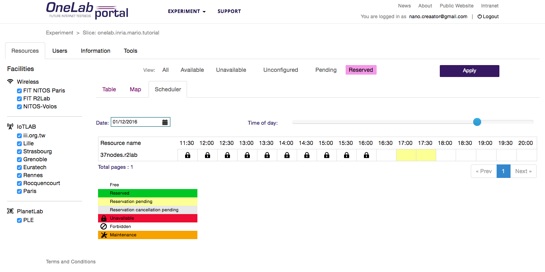
5. Another example of complex screen for the users is the account tab in account option/slice reservation. I am little confused about all these credentials.
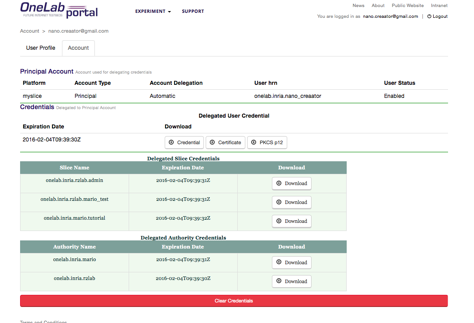
4. The resource names have complex names. (ex.: host2.planetlab.informatik.tu-darmstadt.de)