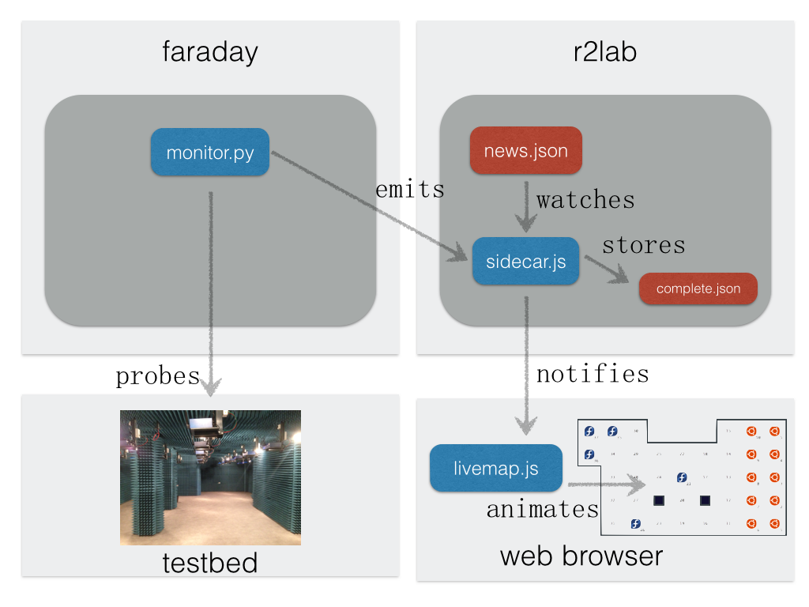

See also [TODO about r2lab.inria.fr](../r2lab.inria.fr/TODO.md)

# faraday

* **has `/root/r2lab` git-updated every 10 minutes**

* runs `monitor.py` through `systemd`
* logs in `/var/log/monitor.log`
* sources in `/root/r2lab/website/sidecar/`

* this essentially repeatedly pushes full results in `news.json` (see location below)

* **NOTE** *git updates* when a new version of `monitor.py` gets pushed into `github`, ***XXX MISSING*** we should `systemctl restart monitor`

# r2lab

* **has `/root/r2lab` git-updated every 10 minutes**
* **also runs `make preview publish` every 10 minutes**

* runs `sidecar.js` through `systemd` 
* sources in `/root/r2lab/website/sidecar/`
* this receives changes from all connected parties (in practice, monitor)
  * this contents gets broadcasted to all web clients through `socket.io`
  * this **does not need** to contain everything; if just one node has changed its `os_release` it is perfectly fine to publish just `[{'id':12, 'os_release':'windows'}]`, and everything else will work as expected
* it also stores consolidated status for whole platform in `/var/lib/sidecar/complete.json`
  * essentially $complete = complete + news$

* **NOTE** *git updates* when a new version of `sidecar.js` gets pushed into `github`, ***XXX MISSING*** we should `systemctl restart sidecar`

# devel notes

* run `monitor.py 19 22 23` for focusing on a set of nodes only

* run `animate.py` locally to simulate new random events cyclically

* run `sudo sidecar.js -l` when running locally on a devel box; this will use json files in current directory as opposed to in `/var/lib/sidecar/`; also `sudo` is required to bind to privileged port `999`

* run `sudo sidecar.js -l -v` for verbose output

## JSON files

  * the 2 `json` files are essentially second-order and do not matter at all 
  * `complete.json` essentially is a way to store stuff across a restart of the sidecar (which is done every 10 minutes)
  * `news.json` was a first attempt at providing an easy way to post new things, but this is not needed **at all* anymore

## JSON format

## v0 - up to 2016/10

What was flying on the bus was of 2 kinds

### `leases` 

* on channels `chan-leases` and `chan-leases-request`
* no change made in this area 

### `status` 

* on channels `chan-status` and `chan-status-request`
* a (possibly partial) list of records
* each one having a mandatory `id` field, an integer
* this is implicitly about **nodes** since there was no other type of info available
* the set of known fields in this record is
  * `id` : node id
  * `available` : set manually by other means (nightly)
  * `cmc_on_off`
  * `control_ping`
  * `control_ssh` 
  * `os_release`: 
    * string from `/etc/fedora-release /etc/lsb-release`
    * it would end with `-gnuradio-{version}` if present
  * `image_radical` : string from last line of `/etc/rhubarbe-image`
  * `wlan<n>_[rt]x_rate` - still in monitor.py --wlan but not mostly obsolete otherwise

## v1 - end october 2016

### channel names

All channels are renamed as follows for consistency

| old name            | new name       |
|---------------------|----------------|
| `chan-leases`         | `info:leases`    |
| `chan-leases-request` | `request:leases` |
| `chan-status`         | **`info:nodes`**     |
| `chan-status-request` | **`request:nodes`**  |
|                       | `info:phones` |
|							| `request:phones` |

### `phones` 

* on the new channels `chan-phones` and `chan-phones-request`
* we have a mechanism very close to the `nodes` thingy
* with the following fields for now
  * `wifi_on_off`: "on" or "off" or "fail"
  * `airplane_mode` : "on" or "off" or "fail"

### `nodes` 

#### renamings
  * the `chan-status` channel into `channel:nodes`
  * the `chan-status-request` channel into `channel:nodes-request`

#### more data probed for each node

* **OK** `usrp_on_off` : "on" or "off" or "fail" 
  * frequent updates from `monitor`
* `usrp_type` : "b210" or "x310" or "none"
  * **needs to be filled manually** for starters - a bit like `available`
  * ideally the nightly should do that later on
* **OK** `gnuradio_release`: 'none' or a version string
  * this would undo the kind of hack we had in place previously
  * that would piggyback the gnuradio version on top of `os_release`
* **OK** `uname`: could be beneficially added in the mix, in order to detect stupid mistakes earlier

