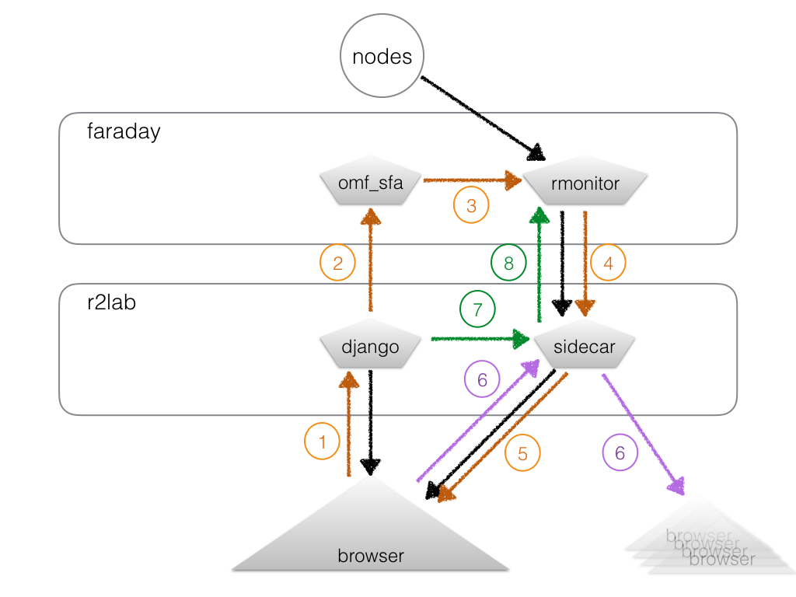

# The leases business

## Task 1 - communication design



*Update on Feb. 17*

At this point:

* the black arrows are in place
* the orange traffic is in place too, although scattered between the 2 devel branches (`master` and `leases`) 
* I am considering to add a green traffic, to avoid the gap in time that users need to wait until their lease gets confirmed
* I am not quite sure if the purple traffic makes sense or not; or rather, I believe that once we have the green thing in place, we won't need the purple traffic at all. So : it's urgent to ***not do anything*** about this one.

#### orange traffic

**DONE.** Here's a summary of how things work

* 1. the django interface offers POST ajax-like URL's to actually add/delete leases
* 2. the way the django service interacts with the `omf_sfa` service is using a SSL connnection; the root certificate of `faraday` is duplicated on `r2lab` (in `/etc/rhubarbe` so that `apache` can read it); it's our way to delegate root rights to the django server
* 3. and 4. `rhubarbe monitor` is extended to send a full picture of future leases on the `chan-leases` channel on a cyclic basis (default 10s)
* 5. `sidecar` simply propagates that traffic to all connected users

#### green traffic

**STANDBY.** I've started to craft this, but it requires monitor to use a more recent library for talking websocket.

Without the green traffic, users have to wait for the next monitor cycle (default is every 10 s) until they can see the confirmation of their action.
That's not quite true for the browser who emitted the API call, but the other ones indeed are in the dark.

So one proposal is
* 7. the django code that sends REST calls to omf-sfa also triggers a signal on the `chan-leases-request` channel towards sidecar
* 7. and 8. `sidecar` propagates this traffic to all connected clients - this aims only monitor as a matter of fact
* 8. `monitor` reacts on receinving this signal by short-fusing its monitoring loop. 

#### purple traffic

**As stated above, I suspect that purple traffic is superfluous. Let's wait and see.**

*Mario has pointed out that it would be convenient for 2 instances of browsers interacting at the same time to exchange 'intentions' to book; as I tried to outline, this is a very different kind if information than the orange traffic, because it's only intentions and has never been confirmed.
My take on this is that it will probably be a nice addition to add the purple traffic at some point, i.e. once we have the orange thing in place, and it's a good thing to keep this in mind. However we also need to bear in mind that the 2 things should be very clearly separated, and this is why I foresee we will use a separate sidecar channel to propagate this information. 
So in a nutshell, this is something we should not care too much about at this point IMHO.*

## Task 2 - leases vizualization

Ongoing

* This is what Mario is working on right now
* There is something to play with in the `leases` branch; still needs to be integrated in `master`
* I suggest we come up with a plugin named liveleases (much like we already have livemap and livetable)

## Task 3 - retrieve (read) leases live

Done

## Task 4 - write leases

Done

## Task 5 - integrate visually

* This IMHO still needs more work
* The layout proposed by Mario: I don't like it too much because of too much wasted space
* I sent another proposal (the slices vlist below livemap)
* But reading this again I realize this does not leave much room for livetable

* Would it make sense to let the user arrange their widgets as they want ?

* Mental model at this point is still that
  * the 'status page' comes with the leases displayed
  * a specific 'scheduler' (or 'plan') page (only when logged in) would show only the scheduler in full page
  * the 'run' page (also only when logged in) would be smart and show the scheduler for the current day, but with as small a footprint as possible

Remaining from previous release : 

```
-------------
l  |
i  | livemap
v  | 
e  +---------
l  |
e  | livetable
a  |
-------------
```

