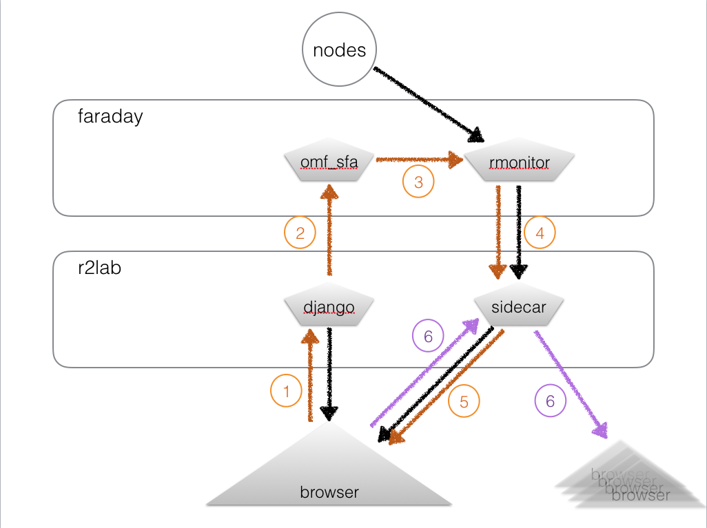

# The leases business

## Task 1 - communication design

We need to close the loop 



At this point:

* the black arrows are in place
* the orange arrows is what we need to do first
* the purple arrows may be considered later on

#### orange traffic
  1. the django interface will offer POST ajax-like URL's to actually add/delete leases; not quite sure yet how this should look like exactly: this should map to the list of actions that need to be triggered when one hits the '*Confirm Booking button*', so it might make sense that the URL can deal with several actions at a time; to be described in more details.
  2. the way the django service will interact with the `omf_sfa` service is - at this point - through a ssh connection. I will open a dedicated access so that apache on `r2lab.inria.fr` can actually issue ssh commands on faraday; even though this is probably a little coarse-grained; we will need the ability for root to set leases on someone else's behalf
  3. it's easy to extend rmonitor so that it gathers all the leases from omf-sfa (actually rhubarbe already has leases-oriented featured like `rleases`)
  4. as far as sidecar, my suggestion is to use a dedicated socket.io channel (or pair of channels) to propagate the orange flow. As a reminder at this point we are using
    * `chan-status` for sending node-oriented status
    * `chan-status-request` as a channel for requesting to broadcast the complete status (essentially at browser startup) (actual content is ignored, it's just a trigger channel)

    So we will probably want to rename these into something more expressive (referring to 'status') and define other channels for exposing leases
  5. the fifth line would IMHO be of the exact same nature as 4. and sidecar will just do the basic forwarding stuff that it already does about status.

#### orange traffic 4. and 5.

Keep in mind that the 'status' traffic is very different in nature from the 'leases' traffic. 
As far as nodes, the universe contains a fixed and finite 37 number of objects. With leases it's quite different, we need a way to describe that leases may have been created, modified or deleted. 

The first naive idea is of course to just send the complete list of leases. Is it safe to assume that the calendar widget is able to cope with this format ?

#### purple traffic

Mario has pointed out that it would be convenient for 2 instances of browsers interacting at the same time to exchange 'intentions' to book; as I tried to outline, this is a very different kind if information than the orange traffic, because it's only intentions and has never been confirmed.

My take on this is that it will probably be a nice addition to add the purple traffic at some point, i.e. once we have the orange thing in place, and it's a good thing to keep this in mind. However we also need to bear in mind that the 2 things should be very clearly separated, and this is why I foresee we will use a separate sidecar channel to propagate this information. 

So in a nutshell, this is something we should not care too much about at this point IMHO.

## Task 2 - leases vizualization

* This is what Mario is working on right now
* I suggest we come up with a plugin named liveleases (much like we already have livemap and livetable)

## Task 3 - retrieve (read) leases live

* I (Thierry) will do this; it covers arrows 3-4-5, and in terms of code it is twofold
  * extend sidecar to create 2 channels (like for status, there will be one for the current status, and one for requesting the data)
  * extend rhubarbe monitor so that this data is fetched at `omf_sfa` and sent in the proper channel as well.

## Task 4 - write leases

* arrow 1: I need more details on what Mario expects (what is behind the *Confirm your booking* thing)
* arrow 2: should be reasonably straightforward 

## Task 5 - integrate visually

* my proposal would be to create a new page 'scheduler' - or maybe 'plan' for the tab name - before the 'run' page
* the 'plan' page would then only have the whole page to display the scheduler which could be on a week or more
* the 'run' page would only show the current day with a layout as narrow as possible, ideally on the side like something of that kind:

```
-------------
l  |
i  | livemap
v  | 
e  +---------
l  |
e  | livetable
a  |
-------------
```

