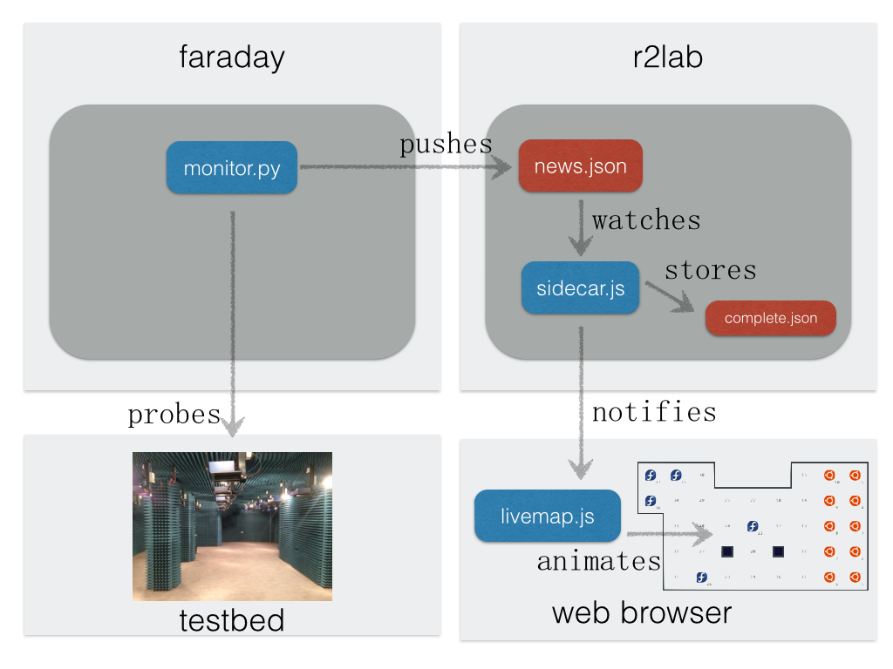

# faraday

* **has `/root/fitsophia` git-updated every 10 minutes**

* runs `monitor.py` through `monitor-loop.sh`
* logs in `/var/log/monitor.log`
* sources in `/root/fitsophia/website/sidecar/`

* this essentially repeatedly pushes full results in `news.json` (see location below)

* **NOTE** *git updates* when a new version of `monitor.py` gets pushed into `github`, nothing is required here as `monitor-loop.sh` repeatedly reinvokes python script
* **NOTE** *reboot* as of now, this is **not** automatically started at run-time

# r2lab

* **has `/root/fitsophia` git-updated every 10 minutes**
* **also runs `make preview publish` every 10 minutes**

* runs `sidecar.js` through `sidecar.sh` 
* sources in `/root/fitsophia/website/sidecar/`
* this watches file in `/var/lib/sidecar/news.json`
  * this contents gets broadcasted to all web clients through `socket.io`
  * this **does not need** to contain everything; if just one node has changed its `os_release` it is perfectly fine to write just `[{'id':12, 'os_release':'windows'}]` in `news.json` and everything else will work as expected
* it also stores consolidated status for whole platform in `/var/lib/sidecar/complete.json`
  * essentially $complete = complete + news$

* logs in `/var/log/sidecar.log`

* **NOTE** *git updates* when a new version of `sidecar.js` gets pushed into `github`, one needs to run `sidecar.sh restart` 
* **NOTE** *reboot* as of now, this is **not** automatically started at run-time

# devel notes

* run `monitor.py 19 22 23` (likewise for `-loop.sh`) for focusing on a set of nodes only

* run `animate.py` locally to simulate new random events cyclically

* run `sidecar.js -l` when running locally on a devel box; this will use json files in current directory as opposed to in `/var/lib/sidecar/`

* run `sidecar.js -v` for verbose output