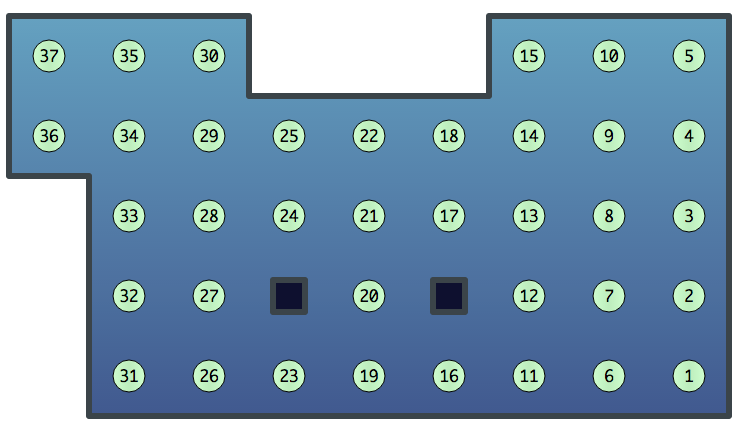
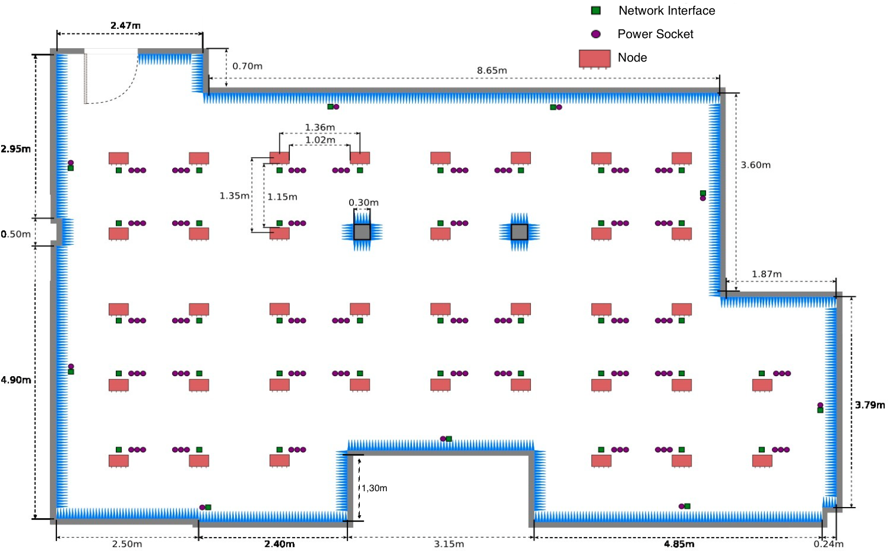

title: Topology
tab: platform
---

R2Lab testbed project offers a hight quality anechoic room for your experiments. Following are the details of the anechoic room.

###Status

Here is the ground plan layout of the anechoic room which provide thirty-seven wireless nodes distributed in a ??m2 room.

	 
	Fig. 1 - Resources status 

 

###Layout

Bla

 

	 
	Fig. 2 - Resources layout 

